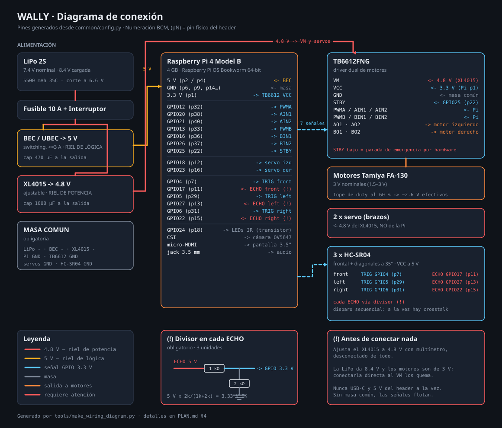

# Wally

Robot de orugas sobre Raspberry Pi 4: visión, cara expresiva, voz y control web.

- **[PLAN.md](PLAN.md)** — diseño completo: hardware, energía, conexionado y fases.
- **[MEMORY.md](MEMORY.md)** — estado del proyecto y decisiones tomadas.
- **[docs/wiring.svg](docs/wiring.svg)** — diagrama de conexión ([ver abajo](#parte-b--montaje-del-hardware)).

## Estado

| Fase | Estado |
|---|---|
| 0 · Energía y bancada | Esperando componentes |
| 1 · `wally-motion` | Código listo, pendiente de validar con hardware |
| 2 · Teleoperación web | Código listo, probado extremo a extremo |
| 3 · Hotspot y red | Código listo, probado extremo a extremo |
| 4 · Cara y voz | Código listo, probado extremo a extremo |
| 5 · Visión (detección) | Código listo, probado extremo a extremo |
| 6 · Autonomía | Código listo. **Las constantes de navegación hay que afinarlas con el robot montado** |

168 pruebas, todas ejecutables sin hardware.

---

# Instalación

## Parte A · Desarrollo en tu equipo

Todo funciona con backends simulados: puedes conducir el robot en el navegador
sin que exista el robot.

### A1. Dependencias

```bash
cd /ruta/a/Wally

python3 -m venv .venv
.venv/bin/pip install -e ".[dev]"

cd ui && npm install && npm run build && cd ..
```

Broker MQTT (necesario para que los servicios se hablen entre sí):

```bash
brew install mosquitto && brew services start mosquitto   # macOS
sudo apt install mosquitto                                # Linux
```

### A2. Comprobar que todo está bien

```bash
.venv/bin/python -m pytest        # deben pasar 168
```

### A3. Conducir en simulación

Cuatro terminales, desde la raíz del proyecto:

```bash
.venv/bin/python -m services.vision --sim     # cámara sintética
.venv/bin/python -m services.motion --sim     # motores simulados
.venv/bin/python -m services.net --sim        # red simulada
.venv/bin/python -m services.web              # servidor web
.venv/bin/python -m services.brain            # comportamiento autónomo
```

Abre **http://localhost:8080**. Verás vídeo sintético y podrás conducir con el
joystick; en la terminal de `motion` se ve el watchdog liberarse al tocarlo y
volver a activarse al cerrar la pestaña.

En modo simulación el detector hace **aparecer y desaparecer una gata** cada
12 segundos, con confianza baja al entrar y salir de plano. Así se prueba la
histéresis de presencia y la reacción de la cara sin pasear un gato por
delante de la cámara. Verás las cajas sobre el vídeo y el aviso «gata a la
vista».

Cada servicio acepta `--no-mqtt` para arrancar aislado, útil al depurar.
`wally-vision` acepta además `--no-detect` para servir solo vídeo.

### A4. Ver la cara y oír la voz

```bash
# La cara en una ventana, recorriendo los ocho ánimos
.venv/bin/python -m services.face --windowed --demo

# La cara reaccionando de verdad a lo que pasa en el robot
.venv/bin/python -m services.face --windowed

# Voz (usa `say` de macOS si Piper no está instalado)
.venv/bin/python -m services.voice --sim --say "Hola, soy Wally"
.venv/bin/python -m services.voice --sim
```

Con la cara corriendo, prueba a provocarle gestos desde otra terminal:

```bash
mosquitto_pub -t wally/cmd/mood     -m '{"mood":"surprised","hold_s":3}'
mosquitto_pub -t wally/state/sensors -m '{"front":120}'     # -> alerta
mosquitto_pub -t wally/state/motion  -m '{"estop":true}'    # -> enfadado
```

Solo motores, sin navegador:

```bash
.venv/bin/python tools/drive_test.py --sim
.venv/bin/python tools/drive_test.py --sim --watchdog
```

---

## Parte B · Montaje del hardware



El diagrama se genera desde `common/config.py`, así que **no puede
desincronizarse del código**. Si cambias un pin en la configuración:

```bash
.venv/bin/python tools/make_wiring_diagram.py
```

> ⚠️ **Este orden no es opcional.** Los motores FA-130 son de 3V nominales y la
> LiPo 2S entrega 8.4V a plena carga. Conectarla directo al `VM` del TB6612 los
> quema. El detalle completo está en [PLAN.md §2 y §4](PLAN.md).

### B1. Ajustar el regulador de potencia

**Con el XL4015 desconectado de todo**, aliméntalo desde la batería y ajusta su
potenciómetro hasta leer **4.8 V** en la salida con un multímetro. Solo después
conecta nada a él.

### B2. Verificar el BEC

Comprueba en su etiqueta que es **switching** y da **≥3 A**. Un BEC lineal o de
1–2 A no sostiene los picos de la Pi 4 y provocará reinicios.

### B3. Cablear

Sigue la tabla punto a punto de [PLAN.md §4.5](PLAN.md). Los puntos que más
gente se salta:

- **Divisores 1kΩ+2kΩ en los tres pines ECHO.** El HC-SR04 emite 5 V y el GPIO
  es de 3.3 V. Sin divisor, se daña el pin.
- **Masa común** entre batería, BEC, XL4015, Pi, driver, servos y sensores.
- **Nunca USB-C y el riel de 5 V del GPIO a la vez.**

### B4. Encendido por etapas

1. Solo la Pi. Comprueba que no hay undervoltage:
   ```bash
   vcgencmd get_throttled     # debe devolver throttled=0x0
   ```
2. Añade el TB6612 **sin motores**. Verifica niveles lógicos.
3. Conecta los motores con la Pi alimentada **aparte**, para aislar un posible
   brownout.
4. Solo entonces, unifica todo en la batería.

---

## Parte C · Instalación en la Raspberry Pi

Escrito para **Raspberry Pi OS Lite (64-bit)**, sin escritorio. Es la opción
correcta para este proyecto: la cara dibuja directo al framebuffer y no hace
falta un entorno gráfico compitiendo por los 4 GB de RAM y por la CPU que
necesita la visión.

Tiempo total: unos 40 minutos, casi todo esperando descargas.

### C1. Grabar la tarjeta

Descarga [Raspberry Pi Imager](https://www.raspberrypi.com/software/) y elige:

- **Dispositivo:** Raspberry Pi 4
- **Sistema:** Raspberry Pi OS (other) → **Raspberry Pi OS Lite (64-bit)**
- **Almacenamiento:** tu SD de 64 GB

Antes de grabar, pulsa el **engranaje** (o *Editar ajustes*) y configura:

| Ajuste | Valor |
|---|---|
| Hostname | `wally` |
| Usuario | el que quieras (aquí se asume `claudio`) |
| Wifi | tu red de casa, país `CL` |
| Zona horaria / teclado | `America/Santiago` / `es` |
| **Habilitar SSH** | ✅ con autenticación por contraseña o clave |

Configurar la wifi aquí te ahorra necesitar monitor y teclado: la Pi arranca
ya conectada. (Aun así, `wally-net` levantará su hotspot si algún día pierde la
red.)

### C2. Primer arranque y acceso

Mete la tarjeta, alimenta la Pi por USB-C **y nada más** —sin motores todavía—
y espera un par de minutos al primer arranque.

```bash
ssh claudio@wally.local
```

Si `wally.local` no resuelve, busca la IP en tu router y usa esa. Que mDNS
funcione depende de tu red; el resto de la guía no lo necesita.

### C3. Actualizar el sistema

```bash
sudo apt update && sudo apt full-upgrade -y
sudo reboot
```

Tarda un rato la primera vez. Vuelve a entrar por SSH cuando reinicie.

### C4. Ajustes base del sistema

```bash
sudo raspi-config
```

Comprueba estas cuatro cosas:

| Menú | Qué hacer |
|---|---|
| **Advanced Options → Expand Filesystem** | Que use toda la tarjeta. Suele hacerse solo, pero conviene verificar |
| **Advanced Options → Network Config** | Debe estar en **NetworkManager**. `wally-net` lo necesita para el hotspot |
| **System Options → Audio** | Elige **Headphones** (el jack de 3.5 mm) |
| **Interface Options → SPI** | Actívalo — lo necesita la pantalla táctil (C10) |
| **Interface Options → I2C** | Actívalo si vas a poner un ADS1115 para medir la batería |

En Bookworm la cámara se detecta sola, así que **no** hay que activar nada de
*Legacy Camera* — esa opción ya no existe y activarla rompería libcamera.

Verifica el espacio disponible antes de seguir:

```bash
df -h /        # necesitas al menos 1.2 GB libres
```

### C5. Comprobar la cámara

Conecta el OV5647 al puerto **CAMERA** (con la Pi apagada; el cable plano va
con los contactos hacia el conector, no hacia el jack de audio) y comprueba:

```bash
libcamera-hello --list-cameras
```

Debe aparecer `ov5647`. Si no sale nada, apaga y revisa que el cable esté bien
asentado por ambos extremos — es el fallo habitual.

### C6. Herramientas mínimas

Raspberry Pi OS Lite viene muy pelado. Instala lo justo para poder trabajar:

```bash
sudo apt install -y git rsync
```

El resto de dependencias las instala `setup.sh` en el paso C8.

### C7. Copiar el proyecto

**Compila la interfaz web en tu equipo primero**, así la Pi no necesita Node:

```bash
# En tu Mac/PC, dentro del proyecto
cd ui && npm run build && cd ..

rsync -av --exclude .venv --exclude node_modules --exclude .git \
    ./ claudio@wally.local:~/wally/
```

Si prefieres clonarlo desde un repositorio, hazlo en `~/wally` y ejecuta el
`npm run build` en la Pi (necesitarás `sudo apt install nodejs npm`, unos
200 MB más).

### C8. Instalar

```bash
cd ~/wally
sudo bash deploy/setup.sh
```

El script hace todo lo siguiente, y es **idempotente**: puedes volver a
ejecutarlo sin romper nada.

1. Comprueba espacio en disco y conexión a internet.
2. Instala los paquetes del sistema: `pigpio`, `mosquitto`, `avahi-daemon`,
   `alsa-utils`, las bibliotecas SDL2 que necesita pygame y **`python3-picamera2`**
   (que en Lite no viene preinstalado).
3. Habilita y arranca `pigpiod` y `mosquitto`.
4. Crea el usuario de servicio `wally` en los grupos `gpio`, `video`, `render`,
   `audio` e `input`.
5. Copia el código a `/opt/wally` y crea el entorno virtual con
   `--system-site-packages`, para que `picamera2` sea visible dentro.
6. Instala las dependencias de Python desde wheels precompiladas.
7. Registra los siete servicios de systemd y los habilita al arranque.
8. **Imprime una comprobación** de qué quedó funcionando y qué falta.

Al terminar verás algo así:

```
==> Comprobación
    OK    pigpiod corriendo
    OK    mosquitto corriendo
    OK    NetworkManager activo
    OK    paquetes de Python
    OK    picamera2 visible
    OK    pigpio (GPIO)
    OK    cámara detectada
    OK    interfaz web compilada
    FALTA modelo de detección
    FALTA voz instalada
```

Los dos últimos son extras opcionales, que se instalan en C9.

### C9. Extras opcionales

Wally funciona sin ellos —se conduce igual— pero estará mudo y sin reconocer
nada.

**Voz** (~70 MB): descarga Piper y una voz neural en español.

```bash
cd ~/wally
bash deploy/install_voice.sh
.venv/bin/python -m services.voice --say "Hola, soy Wally"
```

Si no se oye nada, revisa la salida de audio:

```bash
aplay -l                    # lista las tarjetas; busca "Headphones"
speaker-test -t sine -f 440 -c 2 -l 1
```

**Detección de objetos** (~5 MB más el runtime):

```bash
bash deploy/install_model.sh
```

Descarga EfficientDet-Lite0 (COCO, incluye la clase `cat`) e instala
`tflite-runtime`.

### C10. Configurar la pantalla táctil de 3.2" (MPI3201)

> Este es el paso con más fricción de toda la instalación. Presupuesta una
> sesión entera si la pantalla no arranca a la primera — la razón cambió
> respecto a versiones anteriores de esta guía (antes eran los timings HDMI;
> ahora es el instalador de terceros del panel SPI), pero la fricción sigue
> ahí.

La pantalla (modelo **MPI3201**, controlador ILI9341, táctil resistivo
XPT2046) se monta **directo sobre el header de 40 pines** — no hay cable de
vídeo que conectar. Con la Pi apagada, encájala con cuidado de alinear el
pin 1 (revisa la serigrafía de ambas placas antes de hacer fuerza).

> ⚠️ La placa de la pantalla mide casi lo mismo que la propia Pi, así que una
> vez montada su cuerpo queda por encima de los 40 pines del header, no solo
> de los 8 que usa eléctricamente. Para cablear el resto (motores, servos,
> sensores — PLAN.md §4.5) sin pelear con la pantalla por encima, conviene un
> **cable de extensión GPIO (ribbon/breakout de 40 pines)**: la pantalla se
> conecta a ese breakout en vez de directo a la Pi, y ahí queda accesible
> todo lo demás.

**Habilita SPI:**

```bash
sudo raspi-config nonint do_spi 0
```

(o `Interface Options → SPI` desde el menú, ver C4). Reinicia.

**Instala el driver** con el instalador oficial del fabricante (LCDWIKI),
que además configura el táctil en el mismo paso:

```bash
git clone https://github.com/goodtft/LCD-show.git
chmod -R 755 LCD-show
cd LCD-show
sudo ./LCD32-show
```

Reinicia solo cuando el script lo pida. Confirma que aparece el framebuffer
del panel:

```bash
ls /dev/fb*
```

`LCD32-show` suele remapear la consola a `/dev/fb0` (no crea un `/dev/fb1`
aparte) — es el default que ya trae `config/wally.toml`. Si en tu instalación
aparece distinto, ajusta `fb_device` ahí (no hace falta tocar código,
`common/config.py` → `FaceConfig`).

**El táctil sí se conecta** — a diferencia de la pantalla HDMI anterior, aquí
no hay forma de evitarlo (el conector es el mismo header). `wally-face` ya
reconoce dos gestos sin necesidad de calibrar coordenadas (PLAN.md §8):
toque corto para ciclar de modo, toque largo (3 s) para forzar el hotspot de
red. Si el táctil no responde, vuelve a correr `LCD32-show`: instala vídeo y
táctil juntos, así que si uno de los dos falla suele ser un problema de la
instalación completa, no de un driver aparte.

Si al arrancar la cara ves el cursor de la consola parpadeando por detrás:

```bash
sudo systemctl disable getty@tty1
```

### C11. Configurar y arrancar

```bash
sudo nano /opt/wally/config/wally.toml
```

**Cambia `ap_password`** en la sección `[net]`. Con el hotspot abierto, la
contraseña de tu wifi viajaría en claro durante la configuración inicial.

```bash
sudo systemctl start wally-motion wally-vision wally-web wally-net \
                     wally-face wally-voice wally-brain

systemctl status 'wally-*' --no-pager
```

Los servicios ya quedan habilitados para arrancar solos al encender. Comprueba
que el sistema responde:

```bash
curl http://wally.local:8080/api/health
mosquitto_sub -t 'wally/#' -v      # Ctrl-C para salir
```

### Si algo falla en la instalación

| Síntoma | Causa habitual |
|---|---|
| `setup.sh` aborta por espacio | Falta expandir el sistema de ficheros (C4) |
| `FALTA picamera2 visible` | El venv se creó sin `--system-site-packages`. Borra `/opt/wally/.venv` y repite C8 |
| `FALTA cámara detectada` | Cable CSI mal asentado, o la Pi estaba encendida al conectarlo |
| `FALTA NetworkManager activo` | Imagen antigua actualizada que sigue con dhcpcd. Cámbialo en C4 |
| pip tarda muchísimo | Está compilando en vez de usar wheels. Confirma que el sistema es **64-bit**: `uname -m` debe decir `aarch64` |
| `wally-face` no arranca | El usuario `wally` debe estar en los grupos `video` y `render`. `setup.sh` lo hace; comprueba con `groups wally` |
| Todo instalado pero nada responde | `journalctl -u wally-web -n 50 --no-pager` |

---

## Parte D · Primera puesta en marcha

> 🔧 **Haz esto con el robot suspendido y las orugas al aire.** Un error de
> cableado se descubre mejor sin que salga corriendo de la mesa.

### D1. Configurar la wifi (si no lo hiciste con Imager)

Si no hay wifi guardada, Wally levanta la red **`Wally-Setup`**. Conéctate a
ella con la contraseña de `wally.toml` y abre **http://192.168.4.1:8080** — la
pantalla de configuración se abre sola. Elige tu red, escribe la contraseña y
espera: el robot cambiará de red y esa página dejará de responder, que es lo
normal.

Vuelve a tu wifi de casa y entra en **http://wally.local:8080**.

### D2. Verificar

```bash
curl http://wally.local:8080/api/health
```

Debe devolver `"video": true`. Si `video_age_s` crece sin parar, `wally-vision`
está vivo pero dejó de capturar.

### D3. Probar el movimiento

Con las orugas al aire, mueve el joystick. Comprueba:

- **Sentido de giro.** Si una oruga va al revés, pon `invert = true` en el canal
  correspondiente de `wally.toml` en vez de recablear.
- **El watchdog.** Cierra la pestaña con el robot en marcha: debe frenar en
  medio segundo.
- **La parada de emergencia.** El botón rojo debe cortar de inmediato.

Solo cuando las tres cosas funcionen, ponlo en el suelo.

### D4. Afinar la autonomía

Con el robot ya en el suelo y a mano para cogerlo, activa **Patrulla** desde la
webapp. Lo que hay que observar y ajustar en `[brain]` de `config/wally.toml`:

| Si ves esto… | Ajusta |
|---|---|
| Frena demasiado tarde y toca la pared | Sube `stop_mm` |
| Frena tan lejos que no pasa por puertas | Baja `stop_mm` |
| Vibra o titubea delante de un obstáculo | Sube `turn_min_s` |
| Sale del giro y vuelve a bloquearse enseguida | Sube `clear_mm` |
| Se queda atascado en rincones | Sube `backup_s` o baja `turn_timeout_s` |
| Va demasiado rápido para reaccionar | Baja `cruise_speed` |

**Ten a mano el botón de parada de la webapp** mientras ajustas. Y la primera
vez, prueba en una habitación despejada, no entre las patas de las sillas.

---

# Referencia

## Arquitectura

Servicios independientes bajo systemd, comunicados por MQTT local. Un fallo en
visión no puede dejar los motores encendidos.

```
wally-motion   Único proceso con acceso a GPIO. Motores, servos, sensores
wally-vision   Dueño exclusivo de la cámara
wally-web      FastAPI: webapp, WebSocket, streaming MJPEG
wally-net      Hotspot y configuración de red (único que corre como root)
wally-face     Cara pixel art en la pantalla
wally-voice    TTS con Piper
wally-brain    Comportamiento autónomo: patrulla y seguimiento
```

### Autonomía

Cuatro modos, seleccionables desde la webapp: **Manual**, **Patrulla**,
**Seguir gata** y **Parado**.

**No hace falta cambiar de modo para tomar el control.** Brain y la webapp
escriben en el mismo `wally/cmd/drive`, así que los comandos llevan una marca
`src`: al ver uno ajeno, brain se aparta 3 segundos. Mueves el joystick y el
robot te obedece al instante; lo sueltas y retoma lo que estaba haciendo.

La patrulla tiene tres fases —avanzar, retroceder, girar— con **tiempos
mínimos**. Esa es la parte que de verdad importa: sin ellos, el robot que ve
un obstáculo gira un instante, deja de verlo, avanza, lo vuelve a ver, y se
queda vibrando contra la pared en lugar de rodearla. Por lo mismo, `clear_mm`
(500) es mayor que `stop_mm` (320): si fueran iguales, saldría del giro justo
en el límite y se bloquearía de nuevo al instante.

Persiguiendo a la gata va **más despacio** que patrullando y frena por el
tamaño de su caja en la imagen, nunca por los sensores de distancia — el
ultrasonido no detecta pelaje, así que fiarse de él para no atropellarla sería
justo el error que no se puede cometer.

Si brain se retrasa o muere, deja de publicar y el watchdog de `wally-motion`
frena el robot. Degradar así es el comportamiento correcto, y por eso el
servicio no corre con prioridad elevada.

> ⚠️ **Las constantes de `[brain]` en `config/wally.toml` son estimaciones de
> partida.** Dependen de cuánto derrapan las orugas, cuánto tarda en frenar y
> qué ángulo gira por segundo. Hay que afinarlas con el robot montado, en el
> suelo definitivo y con la batería cargada.

### Cara

Ocho ánimos: `idle`, `happy`, `curious`, `alert`, `sleepy`, `teleop`,
`grumpy`, `surprised`.

La cara **reacciona sola** a lo que le pasa al robot, por orden de prioridad:
parada de emergencia → ánimo pedido por MQTT → obstáculo cerca → en marcha →
inactividad prolongada → reposo. Si solo obedeciera a `cmd/mood`, alguien
tendría que acordarse de mandar el gesto adecuado en cada situación y el robot
parecería apagado casi siempre.

Las expresiones son **geometría interpolable**, no sprites en disco: eso permite
transiciones suaves entre estados sin dibujar los fotogramas intermedios a mano,
y deja el repositorio sin binarios. El pixel art sale de dibujar en 160×120 y
escalar por un factor **entero** (×2 en la pantalla de 320×240), con las
esquinas achaflanadas a mano y sin antialiasing en ninguna primitiva.

### Voz

Piper: neural, offline y en tiempo real en una Pi 4. `espeak` suena a robot de
los ochenta y un TTS en la nube dejaría a Wally mudo sin wifi.

Si Piper o el modelo faltan, el servicio **arranca igualmente** y registra lo
que habría dicho. Un robot mudo sigue siendo útil, así que nunca vale la pena
impedir el arranque por esto.

La cola descarta frases repetidas dentro de una ventana de 8 s — acercándose a
una pared, el aviso de obstáculo llegaría muchas veces por segundo — y al
desbordar tira lo más antiguo, porque comentar algo de hace un minuto es peor
que perderlo.

### Seguridad

Cuatro capas independientes, en orden de cercanía al hardware:

1. **Tope de duty al 60 %** — los motores FA-130 son de 3V y el riel entrega
   4.8V. Se aplica al convertir a duty físico, no al comando.
2. **Watchdog de 500 ms** — sin `cmd/drive` fresco, el robot frena. Cubre red
   caída, pestaña cerrada y servicios muertos.
3. **Parada de emergencia por `STBY`** — lleva el pin de habilitación del
   TB6612 a nivel bajo, cortando ambos canales sin depender del PWM.
4. **El navegador nunca "mantiene" un comando** — el joystick vuelve al centro
   al soltar, al ocultarse la pestaña y al perder el foco; y `wally-web` no
   reenvía el último valor por su cuenta. Dejar de hablar *es* la señal de
   parada.

Cubierto por `tests/test_watchdog.py` y `tests/test_web_control.py`. Si esas
pruebas fallan, el robot puede quedar en marcha tras perder la red.

### Red

Al arrancar, `wally-net` mira si hay perfiles wifi guardados. Si los hay, espera
30 s a que NetworkManager conecte; si no conecta, o no había ninguno, levanta el
AP `Wally-Setup` en `192.168.4.1`.

Estando conectado, si se pierde la red durante 2 minutos vuelve al AP para poder
reconfigurarlo. El plazo es largo a propósito: un router reiniciándose no debe
dejarte sin control del robot.

`wally-net` es el único servicio que corre como root, porque modificar
conexiones de NetworkManager lo exige. `wally-web`, que sí está expuesta a la
red, nunca ejecuta `nmcli`: solo publica mensajes MQTT. Una prueba lo verifica
leyendo su código fuente.

### Visión

`wally-vision` es el único proceso con acceso a la cámara y publica los frames
en `/dev/shm/wally_frame` mediante un seqlock; `wally-web` los lee y los sirve
como MJPEG. No pasan por MQTT: a 15 fps serían ~1 MB/s de serialización inútil.

**La inferencia va en un hilo aparte.** Detectar cuesta ~100 ms en una Pi 4 y
capturar toca cada 66 ms: hacerlo en el mismo bucle dejaría el vídeo a
trompicones. Así el vídeo mantiene sus 15 fps y la detección corre a 5 fps,
que sobra para reaccionar a un gato. Si el hilo está ocupado cuando llega un
frame nuevo, el anterior se descarta — siempre interesa el más reciente, no
acumular una cola de fotogramas viejos.

La gata se reconoce con la clase `cat` de COCO, **sin entrenar nada**: no hay
otros gatos en casa, así que distinguir individuos sería trabajo desperdiciado.

La presencia se filtra con **histéresis asimétrica**: aparecer exige 3
detecciones seguidas, desaparecer exige 12 fotogramas sin verla. Un detector
es ruidoso, y sin este filtro el robot anunciaría «¡la gata!» y se callaría
veinte veces en diez segundos. Que se tape un momento no significa que se haya
ido, y perder el rastro es menos grave que perseguir un fantasma.

El overlay se dibuja en el servidor, antes de comprimir: el frame ya se iba a
codificar, así que sale casi gratis, y aparece también en `/snapshot.jpg` sin
que el cliente tenga que alinear coordenadas con el vídeo.

Deliberadamente **no** se usa `multiprocessing.shared_memory`: su
`resource_tracker` hace unlink del segmento cuando termina cualquier proceso que
lo haya abierto, incluidos los que solo leen. Con `Restart=always`, cada
reinicio de `wally-web` dejaba a `wally-vision` escribiendo en un buffer
huérfano.

## Operación

```bash
# Estado y logs
sudo systemctl status wally-motion
journalctl -u wally-motion -f
journalctl -u wally-net -f

# Reiniciar tras cambiar la configuración
sudo systemctl restart wally-motion

# Espiar el bus (la mejor herramienta de diagnóstico)
mosquitto_sub -t 'wally/#' -v
```

### Comandos MQTT a mano

```bash
# Avanzar. Hay que repetirlo: el watchdog frena a los 500 ms
mosquitto_pub -t wally/cmd/drive -m '{"left":0.5,"right":0.5}'

# Parada de emergencia
mosquitto_pub -t wally/cmd/estop -m '{"engaged":true}'
mosquitto_pub -t wally/cmd/estop -m '{"engaged":false}'

# Brazos
mosquitto_pub -t wally/cmd/servo -m '{"arm_left":90,"arm_right":45}'

# Cara y voz
mosquitto_pub -t wally/cmd/mood -m '{"mood":"happy","hold_s":5}'
mosquitto_pub -t wally/cmd/look -m '{"x":-0.8,"y":0.2}'
mosquitto_pub -t wally/cmd/say  -m '{"text":"Hola gatita"}'
mosquitto_pub -t wally/cmd/say  -m '{"text":"Batería baja","priority":"urgent"}'

# Red
mosquitto_pub -t wally/cmd/net/scan -m '{}'
mosquitto_pub -t wally/cmd/net/hotspot -m '{}'

# Ver lo que detecta
mosquitto_sub -t 'wally/vision/#' -v

# Modo autónomo
mosquitto_pub -t wally/cmd/mode -m '{"mode":"patrol"}'
mosquitto_pub -t wally/cmd/mode -m '{"mode":"follow_cat"}'
mosquitto_pub -t wally/cmd/mode -m '{"mode":"idle"}'
```

### Actualizar el código

```bash
# En tu equipo
cd ui && npm run build && cd ..
rsync -av --exclude .venv --exclude node_modules --exclude .git \
    ./ claudio@wally.local:~/wally/

# En la Pi
sudo bash ~/wally/deploy/setup.sh
sudo systemctl restart 'wally-*'
```

`setup.sh` es idempotente: en una reinstalación se salta lo que ya está y sólo
sincroniza el código, así que tarda segundos en vez de minutos.

## Diagnóstico

| Síntoma | Dónde mirar |
|---|---|
| La webapp carga pero no hay imagen | `systemctl status wally-vision`; `libcamera-hello --list-cameras` |
| `video_age_s` crece sin parar | `wally-vision` vivo pero sin capturar. Reinícialo |
| El joystick no mueve nada | ¿`mosquitto` corriendo? `mosquitto_sub -t 'wally/#' -v` |
| Se mueve a tirones | Wifi débil: si el intervalo entre comandos supera 500 ms, el watchdog frena a cada rato |
| Una oruga va al revés | `invert = true` en `config/wally.toml`, no recablear |
| Los motores no giran | ¿`STBY` en alto? ¿`VM` recibe 4.8V? ¿duty cap demasiado bajo? |
| Arranca y se reinicia solo | Brownout. Revisa el árbol de energía de [PLAN.md §4.1](PLAN.md) |
| `vcgencmd get_throttled` ≠ 0x0 | El BEC no da suficiente corriente |
| No aparece `Wally-Setup` | `systemctl status wally-net`; ¿NetworkManager activo? |
| Tras configurar la wifi no lo encuentro | Ya no está en `Wally-Setup`. Vuelve a tu wifi y usa `http://wally.local:8080` |
| Se quedó sin red y sin hotspot | Espera 2 min: el AP vuelve solo |
| `pigpiod` no arranca | `sudo systemctl start pigpiod`. Sin él, `wally-motion` no funciona |
| La pantalla está en negro | `journalctl -u wally-face`. Suele ser que el usuario no está en los grupos `video` y `render` |
| Wally no habla | ¿Instalaste `deploy/install_voice.sh`? En los logs, `backend de voz: LogBackend` significa que no encontró Piper |
| Habla pero no se oye | `aplay -l` y `raspi-config` → System Options → Audio |
| La cara siempre está dormida | Nadie publica estado. ¿Corren `wally-motion` y `mosquitto`? |
| Hay vídeo pero no detecta nada | ¿Ejecutaste `deploy/install_model.sh`? En los logs aparecerá «sin detección de objetos» |
| El vídeo va a tirones al detectar | Baja `inference_fps` en `config/wally.toml` |
| No reconoce a la gata | Con poca luz el modelo falla. Baja `min_score` o enciende los LEDs IR |
| Detecta la gata donde no está | Sube `min_score`, o `appear_hits` para exigir más evidencia |
| En autónomo no se mueve | ¿Llega `wally/state/sensors`? Sin sensores brain avanza, pero revisa `systemctl status wally-brain` |
| El joystick no le gana al modo autónomo | La webapp debe marcar `src`. Comprueba con `mosquitto_sub -t wally/cmd/drive -v` |
| Choca contra sofás o cortinas | Esperable: el ultrasonido no rebota en superficies blandas. Es el límite del sensor, no un fallo |
